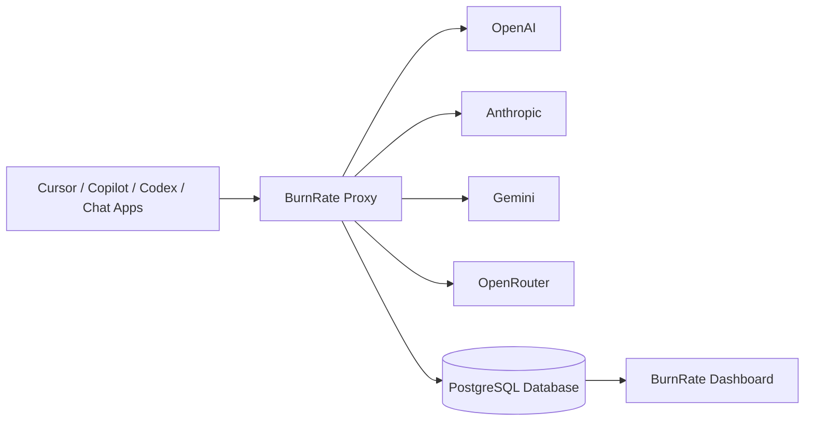
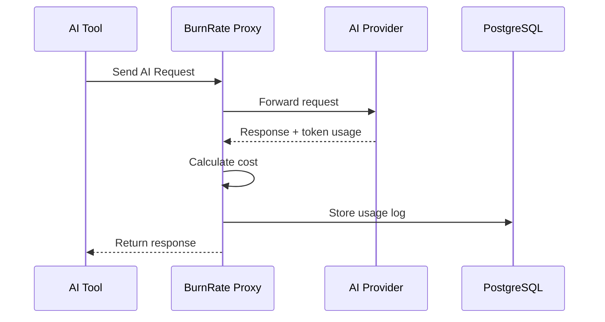
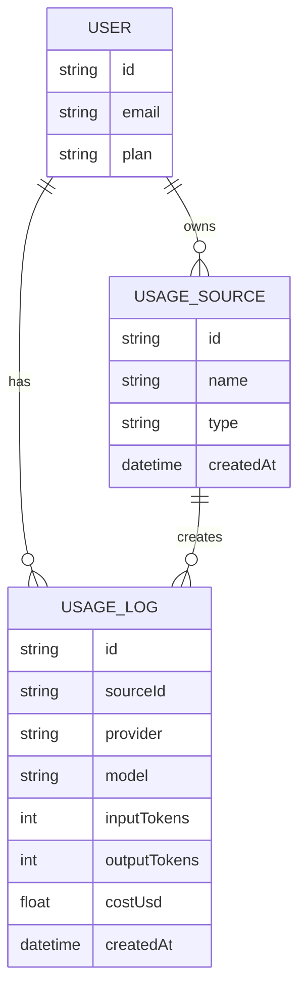

# BurnRate AI

Track how much AI you're actually burning across coding tools, chat apps, and APIs.

BurnRate AI is a developer-first AI usage analytics platform that helps you monitor token consumption, API spend, and estimated AI value across tools like GitHub Copilot, Cursor, OpenAI Codex, Cline, custom apps, and OpenAI-compatible clients.

---

## Why BurnRate?

Modern AI tools hide usage behind subscriptions.

You pay:

- $10/month for Copilot
- $20/month for ChatGPT
- $X for API credits

…but how much AI value are you *actually consuming*?

BurnRate helps answer:

- How many tokens did I burn today?
- Which model is costing me the most?
- Which tool uses the most AI?
- How much AI value did I get relative to what I paid?

Example:

```txt
Paid: $10
Used: $184.27 worth of AI
Value received: 18.4x
```

---

# Core Features

### Usage Dashboard

Track:

- Total AI spend
- Total token usage
- Requests per day
- Usage by model
- Usage by tool
- Average cost per request

---

### Multi-source Usage Tracking

Supports:

- GitHub Copilot
- OpenAI / Codex
- Cursor
- Cline
- OpenAI-compatible clients
- Manual usage imports
- BurnRate Proxy (live tracking)

---

### OpenAI-Compatible Proxy

BurnRate can act as a local proxy between your tools and AI providers:

```txt
Your Tool → BurnRate Proxy → AI Provider
```

This enables:

- real-time token tracking
- request logging
- cost calculation
- latency tracking
- per-app analytics

---

### Import External Usage

Import usage from tools not routed through BurnRate:

- GitHub Copilot AI Credits
- OpenAI Usage Dashboard
- Codex Usage
- Manual entries

---

### Budget Monitoring

Set alerts for:

- daily usage
- monthly spend
- token thresholds

---

# System Architecture

## High-Level Architecture



---

# Request Flow



---

# Database Architecture



---

# Tech Stack

## Frontend

- Next.js 15
- TypeScript
- Tailwind CSS
- shadcn/ui

## Backend

- Next.js API Routes
- Hono Proxy Server

## Database

- PostgreSQL
- Prisma ORM

## AI Providers

- OpenAI
- Anthropic
- Gemini
- OpenRouter

---

# Current Progress

## Completed

- Project setup
- Dashboard UI
- Import Usage page
- System architecture planning
- Database schema design

## In Progress

- Prisma setup
- Usage logging
- BurnRate Proxy

## Planned

- Live OpenAI-compatible proxy
- GitHub Copilot usage import
- OpenAI usage import
- Budget alerts
- API key management
- Team/project analytics

---

# Local Development

## Install dependencies

```bash
npm install
```

---

## Start Next.js app

```bash
npm run dev
```

---

## Run proxy server

```bash
npm run proxy
```

---

# Vision

BurnRate aims to become the single dashboard for understanding your AI usage across every tool you use.

One place to answer:

> “How much AI did I really burn this month?”

---

# Screenshots

_Add screenshots here as development progresses._

---

# Author

Built by Aliasgar Sogiawala
